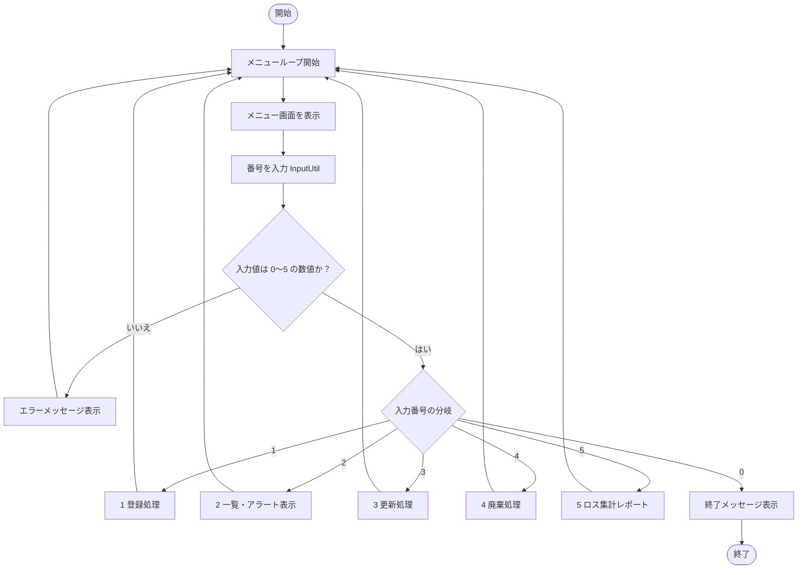
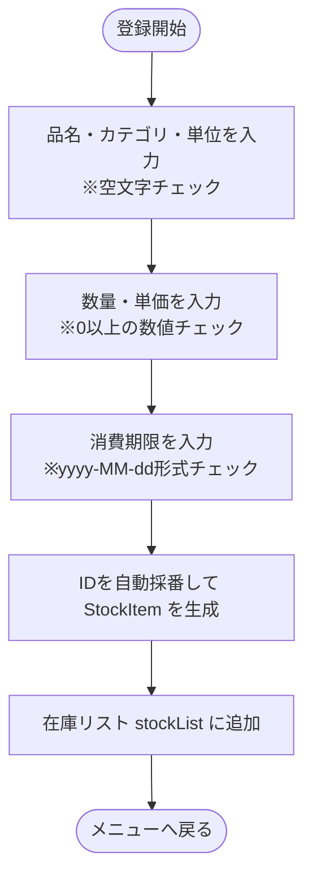
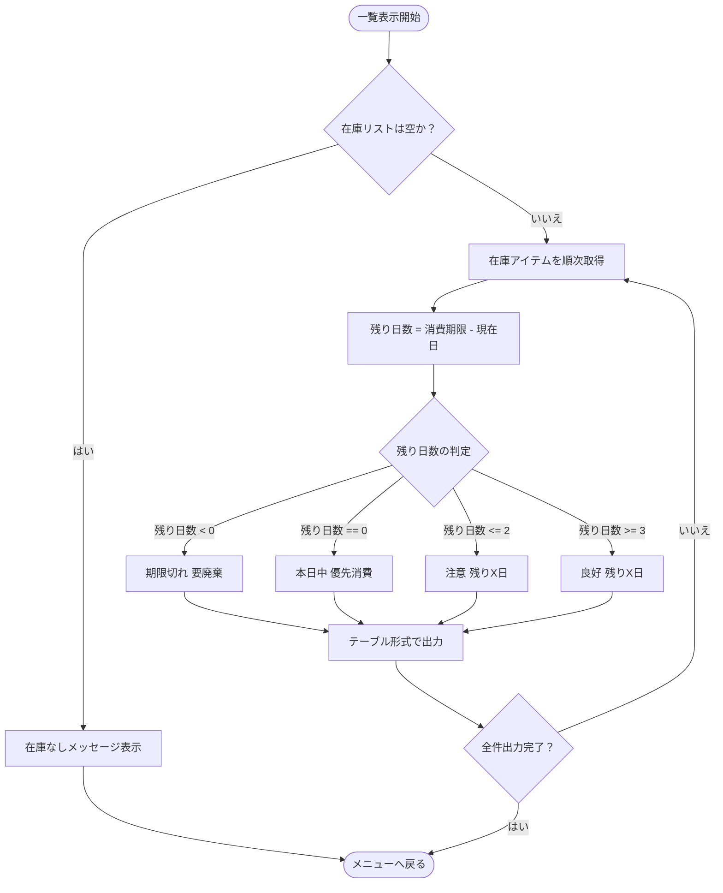
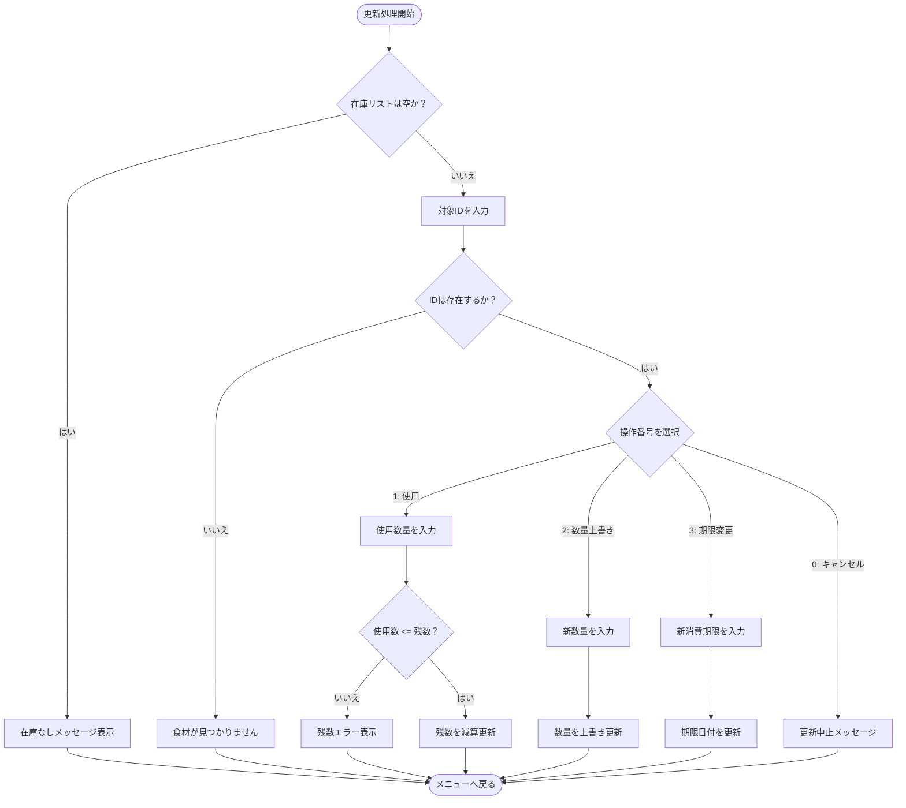
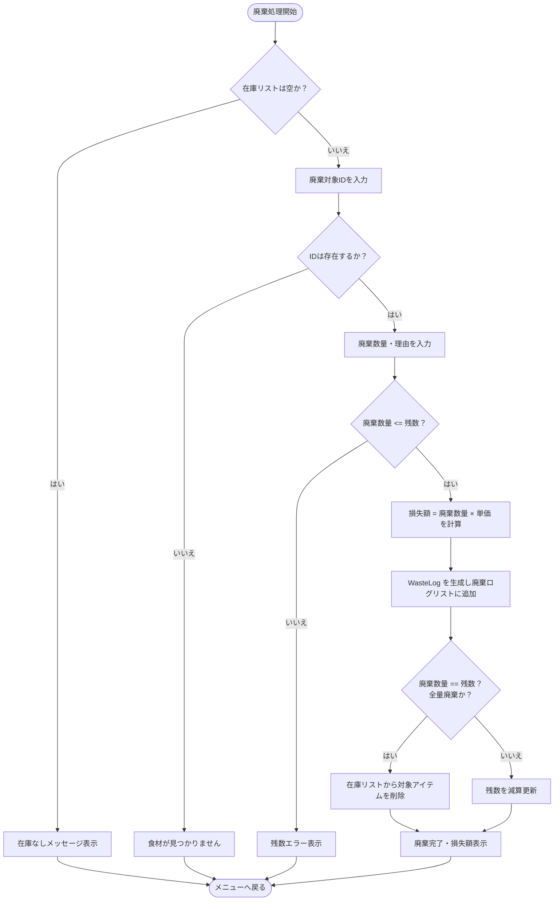
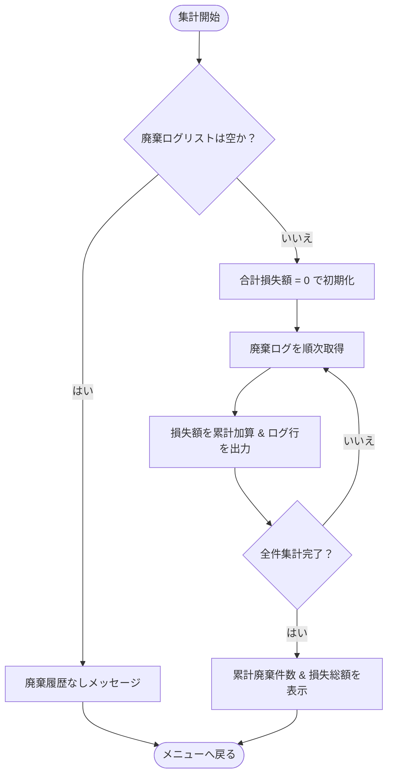

**全体メニューループの分岐フロー**

```mermaid
flowchart TD
    Start([開始]) --> LoopStart[メニューループ開始]
    LoopStart --> ShowMenu[メニュー画面を表示]
    ShowMenu --> InputChoice[番号を入力 InputUtil]
    
    InputChoice --> CheckChoice{入力値は 0〜5 の数値か？}
    CheckChoice -- いいえ --> AlertChoice[エラーメッセージ表示] --> LoopStart
    
    CheckChoice -- はい --> BranchChoice{入力番号の分岐}
    BranchChoice -- 1 --> Flow1[1 登録処理] --> LoopStart
    BranchChoice -- 2 --> Flow2[2 一覧・アラート表示] --> LoopStart
    BranchChoice -- 3 --> Flow3[3 更新処理] --> LoopStart
    BranchChoice -- 4 --> Flow4[4 廃棄処理] --> LoopStart
    BranchChoice -- 5 --> Flow5[5 ロス集計レポート] --> LoopStart
    BranchChoice -- 0 --> EndMsg[終了メッセージ表示] --> EndLoop([終了])

```

---

**1. 登録処理 (Create)**

```mermaid
flowchart TD
    Start([登録開始]) --> InStr[品名・カテゴリ・単位を入力<br>※空文字チェック]
    InStr --> InNum[数量・単価を入力<br>※0以上の数値チェック]
    InNum --> InDate[消費期限を入力<br>※yyyy-MM-dd形式チェック]
    InDate --> CreateModel[IDを自動採番して StockItem を生成]
    CreateModel --> AddList[在庫リスト stockList に追加]
    AddList --> End([メニューへ戻る])

```

---

**2. 一覧・期限アラート表示 (Read)**

```mermaid
flowchart TD
    Start([一覧表示開始]) --> CheckEmpty{在庫リストは空か？}
    CheckEmpty -- はい --> ShowEmpty[在庫なしメッセージ表示] --> End([メニューへ戻る])
    
    CheckEmpty -- いいえ --> LoopItems[在庫アイテムを順次取得]
    LoopItems --> CalcDays[残り日数 = 消費期限 - 現在日]
    
    CalcDays --> JudgeAlert{残り日数の判定}
    JudgeAlert -- 残り日数 < 0 --> AlertExpired[期限切れ 要廃棄]
    JudgeAlert -- 残り日数 == 0 --> AlertToday[本日中 優先消費]
    JudgeAlert -- 残り日数 <= 2 --> AlertWarning[注意 残りX日]
    JudgeAlert -- 残り日数 >= 3 --> AlertGood[良好 残りX日]
    
    AlertExpired --> PrintRow[テーブル形式で出力]
    AlertToday --> PrintRow
    AlertWarning --> PrintRow
    AlertGood --> PrintRow
    
    PrintRow --> CheckNext{全件出力完了？}
    CheckNext -- いいえ --> LoopItems
    CheckNext -- はい --> End

```

---

**3. 在庫更新処理 (Update)**

```mermaid
flowchart TD
    Start([更新処理開始]) --> CheckEmpty{在庫リストは空か？}
    CheckEmpty -- はい --> ShowEmpty[在庫なしメッセージ表示] --> End([メニューへ戻る])
    
    CheckEmpty -- いいえ --> InputID[対象IDを入力]
    InputID --> CheckID{IDは存在するか？}
    CheckID -- いいえ --> ShowNotFound[食材が見つかりません] --> End
    
    CheckID -- はい --> SelectOp{操作番号を選択}
    
    SelectOp -- 1: 使用 --> InputUse[使用数量を入力]
    InputUse --> CheckQty{使用数 <= 残数？}
    CheckQty -- いいえ --> ShowQtyErr[残数エラー表示] --> End
    CheckQty -- はい --> SubQty[残数を減算更新] --> End
    
    SelectOp -- 2: 数量上書き --> InputNewQty[新数量を入力]
    InputNewQty --> SetQty[数量を上書き更新] --> End
    
    SelectOp -- 3: 期限変更 --> InputNewDate[新消費期限を入力]
    InputNewDate --> SetDate[期限日付を更新] --> End
    
    SelectOp -- 0: キャンセル --> Cancel[更新中止メッセージ] --> End

```

---

**4. 廃棄処理 (Delete / ログ記録)**

```mermaid
flowchart TD
    Start([廃棄処理開始]) --> CheckEmpty{在庫リストは空か？}
    CheckEmpty -- はい --> ShowEmpty[在庫なしメッセージ表示] --> End([メニューへ戻る])
    
    CheckEmpty -- いいえ --> InputID[廃棄対象IDを入力]
    InputID --> CheckID{IDは存在するか？}
    CheckID -- いいえ --> ShowNotFound[食材が見つかりません] --> End
    
    CheckID -- はい --> InputWaste[廃棄数量・理由を入力]
    InputWaste --> CheckQty{廃棄数量 <= 残数？}
    CheckQty -- いいえ --> ShowQtyErr[残数エラー表示] --> End
    
    CheckQty -- はい --> CalcLoss[損失額 = 廃棄数量 × 単価 を計算]
    CalcLoss --> AddLog[WasteLog を生成し廃棄ログリストに追加]
    AddLog --> CheckAll{廃棄数量 == 残数？<br>全量廃棄か？}
    
    CheckAll -- はい --> RemoveItem[在庫リストから対象アイテムを削除]
    CheckAll -- いいえ --> UpdateQty[残数を減算更新]
    
    RemoveItem --> Finish[廃棄完了・損失額表示] --> End
    UpdateQty --> Finish

```

---

**5. 廃棄ロス集計レポート (Report)**

```mermaid
flowchart TD
    Start([集計開始]) --> CheckEmpty{廃棄ログリストは空か？}
    CheckEmpty -- はい --> ShowEmpty[廃棄履歴なしメッセージ] --> End([メニューへ戻る])
    
    CheckEmpty -- いいえ --> InitSum[合計損失額 = 0 で初期化]
    InitSum --> LoopLogs[廃棄ログを順次取得]
    LoopLogs --> SumUp[損失額を累計加算 & ログ行を出力]
    
    SumUp --> CheckNext{全件集計完了？}
    CheckNext -- いいえ --> LoopLogs
    CheckNext -- はい --> ShowReport[累計廃棄件数 & 損失総額を表示] --> End

```
